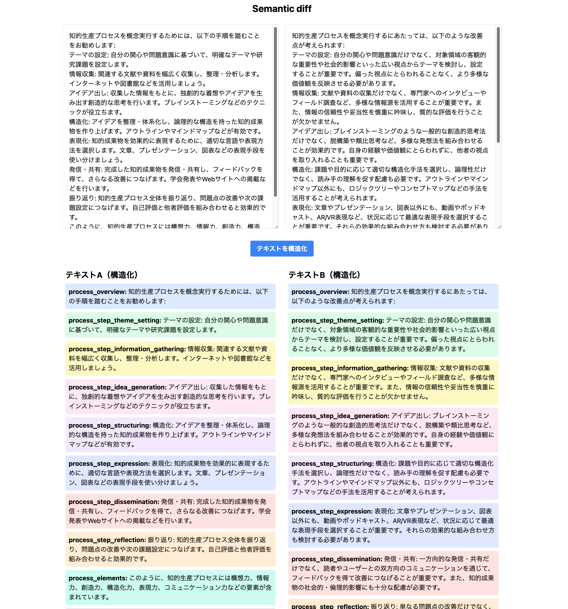

# Description
意味的な違いを視覚的に表示するプロトタイプ<br>
テストは書いてない



# Requirements

## 実行環境

* python, rye
* node, npm

## ENVIRONMENTS
ANTHOLOPICのAPIキーを環境変数に登録する
```bash
export ANTHROPIC_API_KEY="APIキー" >> ~/.bashrc
```

# Run

## backend

```bash
cd backend
rye run python src/backend/main.py
```

## frontend
```bash
cd frontend
npm run dev
```

# Memo
動作が安定しない場合、LLMのAPIコール時に

```{"role": "assistant", "content": "["}```
のような文言を追加することを検討する。

# Tree

.
├── README.md
├── backend
│   ├── app.log
│   ├── main.py
│   ├── pyproject.toml
│   ├── requirements-dev.lock
│   └── requirements.lock
├── frontend
│   ├── next-env.d.ts
│   ├── node_modules
│   ├── package-lock.json
│   ├── package.json
│   ├── pages
│   ├── postcss.config.js
│   ├── styles
│   ├── tailwind.config.js
│   └── tsconfig.json
└── memory
    ├── 41b8718e-5afb-4988-b492-dcba6a8aca02.log
    └── app.log

7 directories, 14 files
